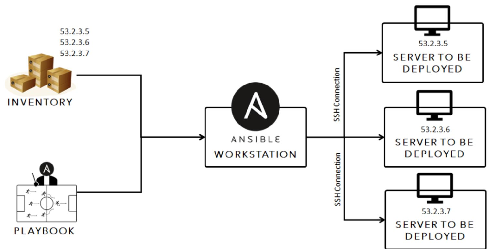

# Ansible controller and agent nodes set up guide
- Clone this repo and run `vagrant up`
- `(double check syntax/intendation)`

## We will use 18.04 ubuntu for ansible controller and agent nodes set up 
### Please ensure to refer back to your vagrant documentation

- **You may need to reinstall plugins or dependencies required depending on the OS you are using.**

```vagrant 
# -*- mode: ruby -*-
# vi: set ft=ruby :

# All Vagrant configuration is done below. The "2" in Vagrant.configure
# configures the configuration version (we support older styles for
# backwards compatibility). Please don't change it unless you know what

# MULTI SERVER/VMs environment 
#
Vagrant.configure("2") do |config|

# creating first VM called web  
  config.vm.define "web" do |web|
    
    web.vm.box = "bento/ubuntu-18.04"
   # downloading ubuntu 18.04 image

    web.vm.hostname = 'web'
    # assigning host name to the VM
    
    web.vm.network :private_network, ip: "192.168.33.10"
    #   assigning private IP
    
    config.hostsupdater.aliases = ["development.web"]
    # creating a link called development.web so we can access web page with this link instread of an IP   
        
  end
  
# creating second VM called db
  config.vm.define "db" do |db|
    
    db.vm.box = "bento/ubuntu-18.04"
    
    db.vm.hostname = 'db'
    
    db.vm.network :private_network, ip: "192.168.33.11"
    
    config.hostsupdater.aliases = ["development.db"]     
  end

 # creating are Ansible controller
  config.vm.define "controller" do |controller|
    
    controller.vm.box = "bento/ubuntu-18.04"
    
    controller.vm.hostname = 'controller'
    
    controller.vm.network :private_network, ip: "192.168.33.12"
    
    config.hostsupdater.aliases = ["development.controller"] 
    
  end

end
```

# Why Ansible?

    It is the fastest growing python-based open source IT automation tool that can be used to configure/manage systems, deploy applications and provision infrastructure on numerous cloud platforms.

Benefits :

    Save time
    Open source
    Makes configuration management predictable
    Cost effective

Why use it:

    Ansible is angentless because we only need to have ansible installed on the controller.
    We connect using SSH - this also adds to its simplicity




# Working with Ansible
SSH into the controller with `vagrant ssh controller`
We'll update/install dependecies:
- `sudo apt-get update -y`
- `sudo apt-get install software-properties-common`
- `sudo apt-add-repository ppa:ansible/ansible`
- `sudo apt-get update`
- `sudo apt-get install ansible`

Now check Hosts:
- `cd /etc/ansible/`
- `sudo apt-get install tree`
- `tree`
- `ansible all -m ping`
Add hosts:
- `sudo nano hosts`
- Add 
```
[web]
192.168.33.10 ansible_connection=ssh ansible_ssh_user=vagrant ansible_ssh_pass=vagrant

[db]
192.168.33.11 ansible_connection=ssh ansible_ssh_user=vagrant ansible_ssh_pass=vagrant
 ```
To acces`ssh vagrant@192.168.33.10`
Check all the servers:
- `ansible all -a "uname -a"` # Check names
- `ansible all -a "date"`     # Check dates
- `ansible all -a "free -m"`  # Check memory

## Make a YAML Playbook file (TAB doesn't work - yet indentation matters):
### Install nginx in web
- `sudo nano nginx_playbook.yml`
- Add:
```
# A playbook to install and set up Nginx
# A YAML file need to start with 3 dashes

---
# Name of the hosts - needs to be defined in hosts file
- hosts: web

# Find the facts about the hosts
  gather_facts: yes

# We need admin access
  become: true

# Add instructions using tasks module in ansible
  tasks:
  - name: install nginx

# Install nginx
    apt: pkg=nginx state=present update_cache=yes

# Ensure its running/active
    notify:
    - restart nginx
  - name: Allow all access to tcp port 80
    ufw:
      rule: allow
      port: '80'
      proto: tcp

  handlers:
    - name: Restart Nginx
      service:
        name: nginx
        state: restarted

# Update cache
# Restart nginx if needed like reverse proxy
```
- `ansible-playbook nginx_playbook.yml`
- `ansible web -m shell -a "systemctl status nginx"`

Copy app from local to VM:
- `vagrant plugin install vagrant-scp`
- `vagrant scp C:/Users/Urbon/VagrantProjects/eng89_01/app app`

### Installing mongodb
- `sudo nano mongodb_playbook.yml`
- Add:
```
# This is a YAML file to install nginx onto oue web VM using YAML
---

- hosts: db

  gather_facts: yes

  become: true

  tasks:
  - name: install mongodb
    apt: pkg=mongodb state=present

  - name: Remove mongodb file (delete file)
    file:
      path: /etc/mongodb.conf
      state: absent

  - name: Touch a file, using symbolic modes to set the permissions (equivalent to 0644)
    file:
      path: /etc/mongodb.conf
      state: touch
      mode: u=rw,g=r,o=r


  - name: Insert multiple lines and Backup
    blockinfile:
      path: /etc/mongodb.conf
      backup: yes
      block: |
        "storage:
          dbPath: /var/lib/mongodb
          journal:
            enabled: true
        systemLog:
          destination: file
          logAppend: true
          path: /var/log/mongodb/mongod.log
        net:
          port: 27017
          bindIp: 0.0.0.0"

```

### Installing node and running app
- `sudo nano node_run.yml`
- Add:
```

# This is a playbook to install and set up Nginx in our web server (192.168.33.10)
# This playbook is written in YAML and YAML starts with three dashes (front matter)

---
# name of the hosts - hosts is to define the name of your host of all
- hosts: web

# find the facts about the host
  gather_facts: yes

# admin access
  become: true

# instructions using task module in ansible
  tasks:
  - name: Install Nginx

# install nginx
    apt: pkg=nginx state=present update_cache=yes

-
  name: "installing nodejs"
  hosts: web
  become: true
  tasks:
    - name: "add nodejs"
      apt_key:
        url: https://deb.nodesource.com/gpgkey/nodesource.gpg.key
        state: present
    - name: add repo
      apt_repository:
        repo: deb https://deb.nodesource.com/node_13.x bionic main
        update_cache: yes
    - name: "installing nodejs"
      apt:
        update_cache: yes
        name: nodejs
        state: present
-
  name: "reverse proxy"
  hosts: web
  become: true
  tasks:
    - name: "delete current default"
      file:
        path: /etc/nginx/sites-available/default
        state: absent
    - name: "create file"
      file:
        path: /etc/nginx/sites-available/default
        state: touch
        mode: 0644
    - name: "change default file"
      blockinfile:
        path: /etc/nginx/sites-available/default
        block: |
          server{
            listen 80;
            server_name _;
            location / {
            proxy_pass http://192.168.33.10:3000;
            proxy_http_version 1.1;
            proxy_set_header Upgrade $http_upgrade;
            proxy_set_header Connection 'upgrade';
            proxy_set_header Host $host;
            proxy_cache_bypass $http_upgrade;
            }
          }
      notify:
        - Restart nginx
    - name: update npm
      command: npm install pm2 -g -y
  handlers:
  - name: Restart nginx
    service:
      name: nginx
      state: restarted
- name: "starting app"
  hosts: web
  become: true
  tasks:
   - name: "adding DB_HOST"
     blockinfile:
       path: .bashrc
       block: |
         DB_HOST=mongodb://192.168.33.11:27017/posts
   - name: "starting node.js"
     shell: |
       source ~/.bashrc
       cd app/
       npm install
       node seeds/seed.js
       pm2 kill
       pm2 start app.js
```
